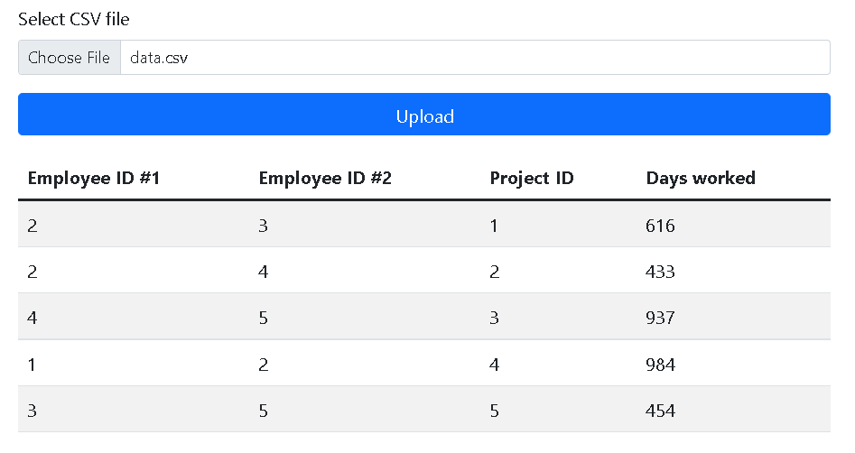

# Getting Started

### We have 2 applications

* Java application (Application.java) that reads csv file from resources folder process it and writes
the result in csv file named output_{timestamp}.csv in the root projects diectory

* Spring boot application (SpringEmployeesApplication.java) that after starting can 
 be accessed from browser [localhost:8080](http://localhost:8080), files with extensions
 txt and csv can be selected and clicking the upload button will send the file to processing
 and display a result in a grid 

